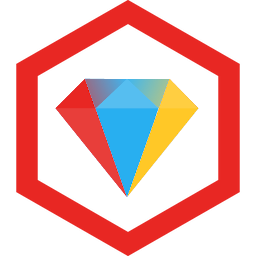
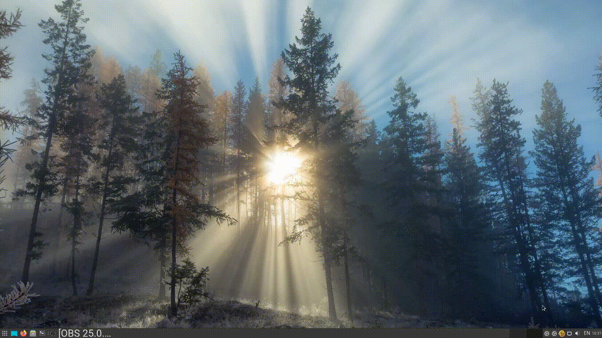
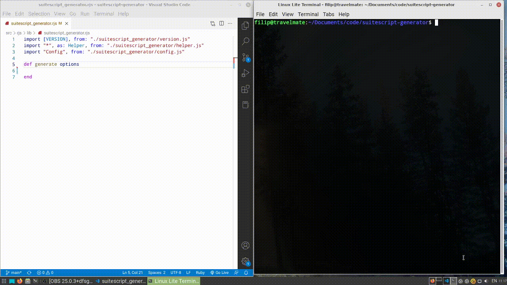

<h1 align="center">
  <a href="https://rubygems.org/gems/rubyjs-vite">
    <!--  -->
    <!--  -->
    
  </a>
  <p>RubyJS Vite</p>
  <p align="center">
    <a href="https://github.com/filipvrba/ruby-js/blob/main/LICENSE">
      
    </a>
  </p>
</h1>

Web applications may be made with the help of RubyJS Vite. The programmer can avoid using JS syntax, which is helpful. Everything is done automatically; all you have to do is start the server and build a project using scaffolding.

Write your code using the JS api and Ruby syntax, and the server will automatically translate it. It then stores it in a file with the extension ".js". You will then be able to publish the project to [Vercel](https://vercel.com/) or directly to the [NPM package](https://www.npmjs.com/), and you will have a website that is written in the native JS language.

### Content
- [Why use this tool?](#why-use-this-tool)
- [1 Installation](#1-installation)
- [2 Usage](#2-usage)
  - [2.1 Scaffold](#21-scaffold)
  - [2.2 More parameters](#22-more-parameters)
- [3 Development](#3-development)
- [4 Unexpected errors](#4-unexpected-errors)
  - [4.1 Third-party libraries](#41-third-party-libraries)
  - [4.2 NPM](#42-npm)
- [5 Examples](#5-examples)
- [6 Documents](#6-documents)
- [7 Contributors](#7-contributors)
- [8 Log](#8-log)

## Why use this tool?
For me, developer productivity is everything. It is vital to link these codes together if one developer is proficient in Ruby and another in JS. As a result, a module written in Ruby can be connected in JS, and vice versa. Additionally, Vite makes it simpler to launch the server and develop the project.

## 1 Installation
The executable application and libraries are installed using the ruby gem during installation.

```bash
gem install rubyjs-vite
```

## 2 Usage
RubyJS Vite has a unique command that can be used at the terminal called **rjsv**.

### 2.1 Scaffold
The **—create** parameter should be followed by the project name if you want to create your own project.

*Use this command as an example, then follow the instructions the terminal gives you:*
```bash
rjsv --create hello
```



### 2.2 More parameters
If you only need to convert files to *.js* format rather than build scaffolding.
Therefore, there is an argument for this function called **-c** or **—compile**.

You must include an additional parameter called **-w** or **—watch** so that the compilation always happens after saving the *.rjs* file.

Other choices include which directory will be searched for updated files and which directory will house all transformed code. The code can also be converted into the chosen EC level, with 2021 as the default level. Enter **rjsv -h** in the terminal for more details.

*Example for compiling and tracking files:*
```bash
rjsv -c -w -s src/rjs -o src/js
```



> ### Info
> If *scaffolding* was used in the project's construction, a **bin/watch** executable is embedded.

## 3 Development
Look in the *'lib'* folder if you want to edit this RubyJS Vite project. Everything you require for file transformation and change tracking is available. The console portion is under the *'app'* subdirectory. Everything that needs to be executed with various arguments is available here. 

*The following third-party libraries are employed:*
- [ruby2js](https://rubygems.org/gems/ruby2js)
- [listen](https://rubygems.org/gems/listen)

## 4 Unexpected errors
When using this utility, some problems could happen.

### 4.1 Third-party libraries
Certain library dependencies must be installed for the program to function as a whole. (The section on [development](#3-development) has more details regarding libraries.)

*Use this command if the software indicates that the library was not found:*
```bash
gem install ruby2js listen
```

### 4.2 NPM
The process of constructing a project could go wrong. This is because Vite is attempting to be installed using the NPM tool during the scaffolding phase. This indicates that your machine does not have NodeJS installed. [Installing it is necessary!](https://nodejs.org) Run a command in your project to install the Vite library after you've finished the installation.

*Vite installation command:*
```bash
npm install -D vite
```

You can launch the server and begin developing your project after the installation has been successfully completed.

*An order to launch the server:*
```bash
bin/server
```

## 5 Examples
Here, I'll outline a few projects where RubyJS Vite was applied to alter code.

- [adb2-weapon-rjs](https://github.com/filipvrba/adb2-weapon-rjs) - Here, a web application was built with scaffolding and uploaded to Vercel.
- [edu-game-rjs](https://github.com/filipvrba/edu-game-rjs) - An web application that is a learning game. The utilization of scaffolding and uploading to Vercel.
- [engine2d-rjs](https://github.com/filipvrba/engine2d-rjs) - This engine renders video games. For this project, scaffolding and unified code generation were employed.
- [mtg-gui-rjs](https://github.com/filipvrba/mtg-gui-rjs) - A web application that uses an API to connect to databases and exchange data.
- [cv-v](https://github.com/filipvrba/cv-v) - A web CV (portfolio) application that is multilingual-programmed. RJS is used to create the front-end whereas V is used to create the back-end. The website has been upload on a fly.io cloud.
- [dragonruby-egg-ui-rjs](https://github.com/filipvrba/dragonruby-egg-ui-rjs) - A web page that is like a module manager. It displays all added repositories for DragonRuby and uses the REST API for the backend.

## 6 Documents
Using the RubyJS-Vite utility is explained in the following documents.

- [Godot with Ruby syntax](./docs/gwrs.md)
- [Godot with Ruby syntax II](./docs/gwrs_2.md)

## 7 Contributors
- [Filip Vrba](https://github.com/filipvrba) - creator and maintainer

## 8 Log
- **1.1.3**
  - Remove:
    1. Filter for camel case.

- **1.1.2**
  - Added:
    1. When the RJS file is changed, the *SIGUSR1* signal is called if the value for PID is set.

  - Fix:
    1. Fix package that wraps shared files.
    2. Bug fix for automatic file deletion.

- **1.1.1**
  - Fix:
    1. Fix for file copy function.

- **1.1.0**
  - Fix:
    1. Bash script for server. The linux signal is used to shut down rjsv applications.
    2. Creating a scaffolding will not create a conflict with an already created folder (the ideal solution for a cloned repository).