### Content
- [1 Godot with Ruby syntax](#1-godot-with-ruby-syntax)
  - [1.1 What exactly is it about?](#11-what-exactly-is-it-about)
- [2 Preparation](#2-preparation)
  - [2.1 Godot Editor](#21-godot-editor)
  - [2.2 ECMAScript Module](#22-ecmascript-module)
  - [2.3 SCons](#23-scons)
  - [2.4 RubyJS-Vite](#24-rubyjs-vite)
- [3 Compilation](#3-compilation)
  - [3.1 Path](#31-path)
  - [3.2 Operating system type](#32-operating-system-type)
  - [3.3 Assembly](#33-assembly)
- [4 Godot](#4-godot)
  - [4.1 Startup](#41-startup)
    - [4.1.1 New project](#411-new-project)
  - [4.2 Configuration](#42-configuration)
  - [4.3 Customization](#43-customization)
    - [4.3.1 Command](#431-command)
    - [4.3.2 Executable command parsing](#432-executable-command-parsing)
- [5 Scripting](#5-scripting)
  - [5.1 Script writing](#51-script-writing)
- [6 Scene](#6-scene)
  - [6.1 Input](#61-input)
  - [6.2 Character](#62-character)
  - [6.3 Main](#63-main)
  - [6.4 Play the Project](#64-play-the-project)
- [7 Conclusion](#7-conclusion)
  - [7.1 Advantages & Disadvantages](#71-advantages--disadvantages)
  - [7.2 Other options](#72-other-options)
- [8 Comment](#8-comment)

## 1 Godot with Ruby syntax
The *Godot* game engine features a visual editor.
Since it is cross-platform, virtually anywhere can use it.
An intriguing phenomenon is its code architecture.
As this engine is still in its infancy, I'm happy to constantly learn from the developer.
The ability to simply add modules to it piqued my curiosity the most.
There are various methods you can choose from.

*Here are several possibilities:*
1. Add the module directly to the editor's source code,
2. extend the editor with a native script.

Whatever we wish to accomplish in *Godot* will depend on it.
I'd like to expand the engine using the Ruby language, as the author advises.
The fact that we have a variety of technology at our disposal to
enable this only adds to the excitement. 

> ### Info
> I regret to inform you that this strategy is somewhat experimental.

### 1.1 What exactly is it about?
What you will learn from this post has to be made clear. You will discover how to
create a *Godot Editor* extension module that runs *ECMAScript (JS)*. You will
learn how to use the *RubyJS-Vite* script translation tool to make the *Ruby*
syntax function. 

## 2 Preparation
Here, preparation is key. I'll list the four steps
you need to take in order for everything to function properly.

### 2.1 Godot Editor
By obtaining the repository source code, we can now concentrate on the editor itself.
I advise it download *release versions* so that we don't download
the full repository with the git history. 

*Here is the download link:*
- Source Code: [3.5.1-stable.zip](https://github.com/godotengine/godot/archive/refs/tags/3.5.1-stable.zip)

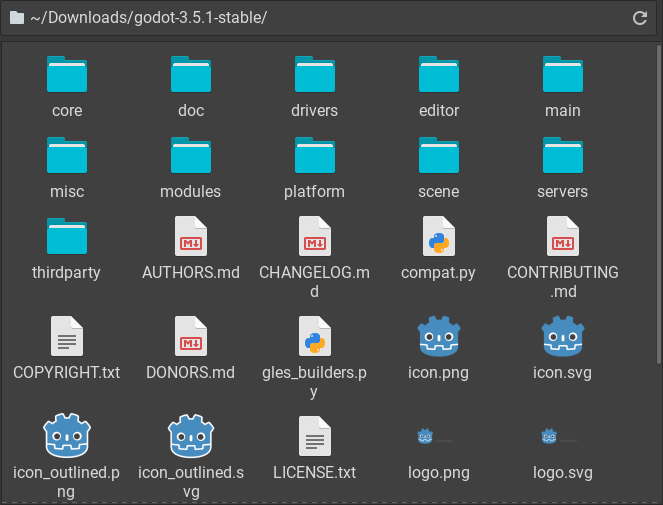

(pic. 1) Once the file has been downloaded, extracted, and opened,
we will find everything needed to assemble the *Godot Editor* in the directory. 

### 2.2 ECMAScript Module
We can see the *"modules"* folder, which is where the extension editor
functionality will be placed. Clone the *ECMAScript* repository
into it to accomplish this. 

*Using this command, the repository is copied to the specified folder:*
```bash
git clone https://github.com/Geequlim/ECMAScript.git \
~/Downloads/godot-3.5.1-stable/modules/ECMAScript
```

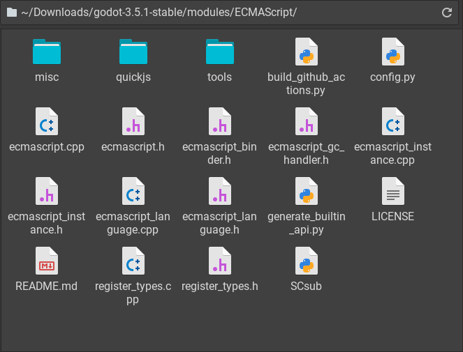

(pic. 2) We now get the *ECMAScript* module's source codes thanks to cloning.

### 2.3 SCons
All of the source codes are prepared for compilation.
Installing the essential tool will allow us to compile all
of the source code into the appropriate operating system.
We'll accomplish this by downloading *SCons* from the *Python* ecosystem. 

*Here is the command to download the SCons tool:*
```bash
pip install scons
```

*Let's use the following command to verify the version after installation:*
```bash
scons -v
```

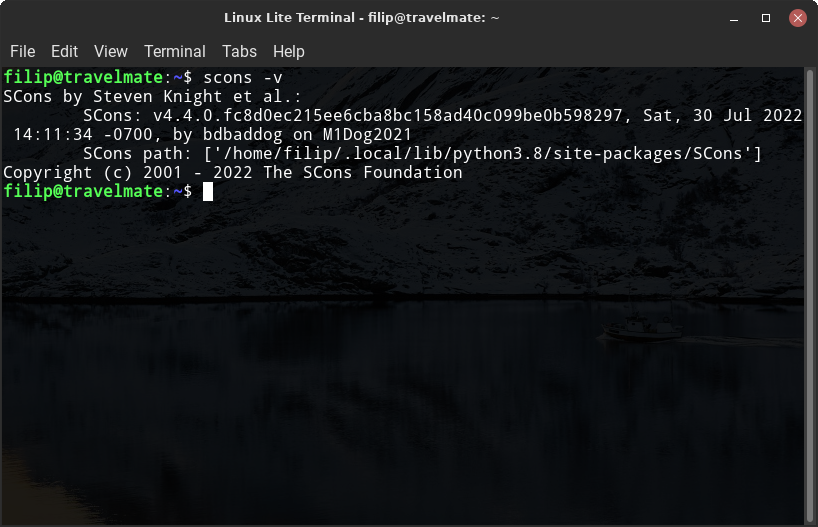

(pic. 3) If the software answers, your installation of the *SCons* utility was successful.

### 2.4 RubyJS-Vite
This preparation will be followed by the download of the *RubyJS-Vite* tool.
After the *Godot Editor* compilation is complete, we will mostly use it.
The tool must be running the proper **version 1.0.8**.
Please check the version of any pre-downloaded tools you
may already have and update them if necessary. 

*To install the tool, enter the following command:*
```bash
gem install rubyjs-vite
```

*This command verifies the tool's version:*
```bash
rjsv -v
```

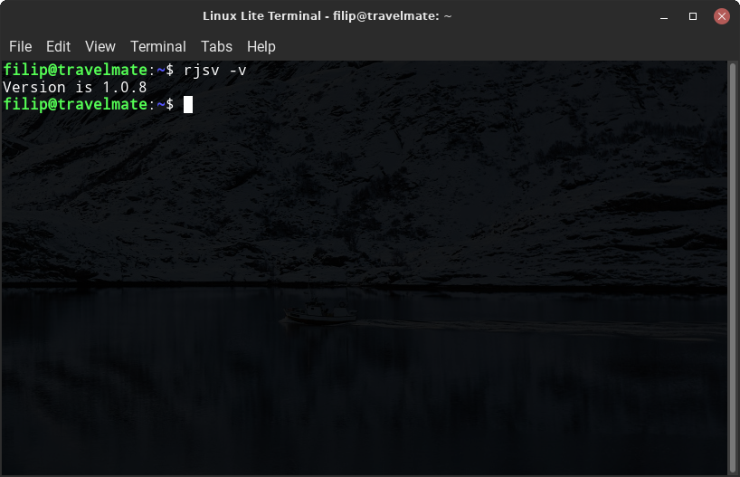

(pic. 4) You have correctly installed the *RubyJS-Vite* utility if the
software responds and is the correct version. 

## 3 Compilation
The *Godot Editor* may now be built, but first we must decide
which operating system we will build it for.
The *SCons* tool will be used to gather the required data,
after which the *Godot Editor* compilation command will be modified. 

### 3.1 Path
Open a terminal and set the ideal path to the directory
containing the primary *Godot* source files. 

*Here is the path setting command:*
```bash
cd ~/Downloads/godot-3.5.1-stable
```

### 3.2 Operating system type
We will now determine the operating system type using the *SCons* utility.

*The command that will be used to accomplish this is:*
```bash
scons platform=list
```

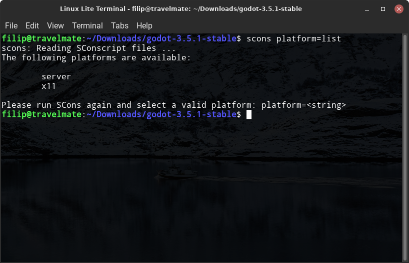

(pic. 5) Whatever platforms we can utilize for compilation will be displayed on the terminal.

> ### Info
> My computer has *Linux* installed, therefore I can see *server* and *x11*. 

### 3.3 Assembly
After figuring everything out, we can now modify the Godot Editor assembly command.
The *x11* platform is what I use in a *Linux* environment.
**You select a platform based on the operating system you are using.**

> ### Info
> Compilation time varies and is based on the hardware in your *System*.
> From my experience, *C++* compilation takes longer than *C* itself.
> So while you wait for the compilation to finish, feel free to make some tea or coffee.

*With the following command, we begin the compilation:*
```bash
scons platform=x11
```

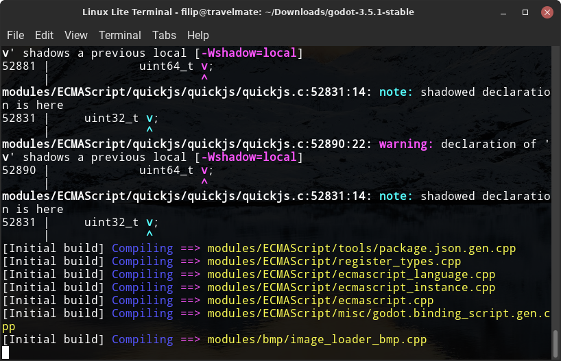

(pic. 6) During compilation, a tool will alert us;
do not be alarmed by messages that display a warning.
This won't impact startup for a finished Godot Editor build. 

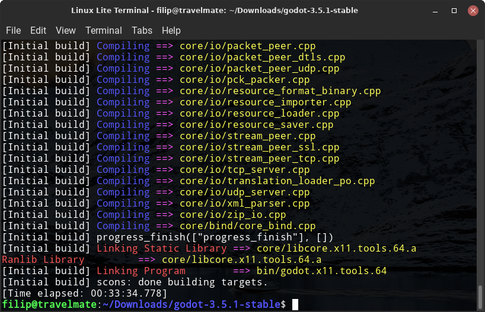

(pic. 7) The prompt notifies us that *SCons* has passed the report's end after it is finished.
Additionally, it provides us with time-related information such
as how long the compilation took and where the executable was saved *(to a directory)*. 

## 4 Godot
We took our time with the compilation, and now that we've
had some tea, we can finally launch the *Godot Editor* with the
*ECMAScript* module in place. We'll start a new project, set up
the *Godot Editor*, and then use a command that we'll describe later
to modify the project. 

### 4.1 Startup
The *SCons* tool created an executable file for us to place in the *"bin"*
folder in order to start the *Godot Editor*. 

*Let's use this command to launch the Godot Editor:*
```bash
bin/godot.x11.tools.64
```

### 4.1.1 New project
As soon as we start a new project, we give it the name *"rubyjs"*
and save it in the correct directory. After filling everything out,
click *"Create"*, which will launch the editor for us so we can begin
working on our test project. 

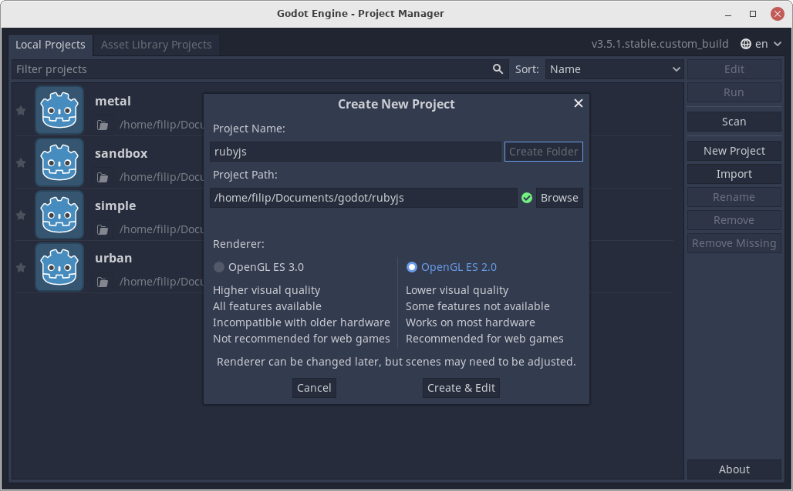

(pic. 8) The *Godot Project Manager's* primary window, complete with the
information needed to start a new project.

### 4.2 Configuration
So, we must set up the *Godot Editor* before we can script our game nodes in *Ruby* syntax.
The start of the external text editor will be properly timed. 

After selecting *"Editor"*, look in the upper left corner for the editor settings.
When the opportunity to select from a list of necessary tasks is next provided
to us, we'll choose the first choice, *"Editor Settings..."*.
We navigate to the *"Text Editor -> External"* area in the editor window that opens.
We enable using an external editor, write the command that will start the editor,
and the appropriate flags to open the needed file. 

> ### Info
> The text editors *VSCode* and *Emacs* are supported by *Godot* officially.
> As I use *VSCode*, I write *Flags* in accordance with the guidelines.
> I suggest visiting
> [this website](https://docs.godotengine.org/en/stable/tutorials/editor/external_editor.html)
> if you're using another text editor.

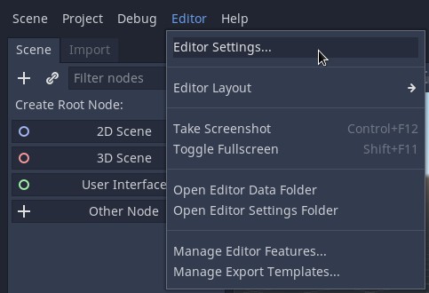

(pic. 9) *Godot Editor* setup menu that has been rendered.

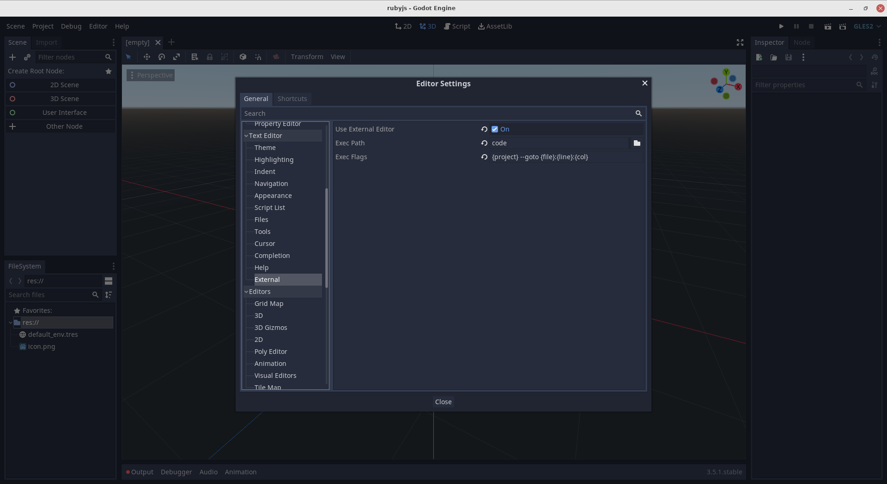

(pic. 10) A window that is open and populated with data in the *Godot Editor's*
built-in external text editor. 

### 4.3 Customization
Let's now modify the *"rubyjs"* project.
The project's files are located in the *FileSystem* Window.
The executable file and script folders need to be generated in their own folders.
The *bin* folder now contains a bash script that will launch the *RubyJS-Vite* application.
It will expand permissions to run for a bash script.

*The tree hierarchy should like the following:*
```txt
.
├── bin
│   └── watch  (bash script)
└── src
    └── rjs
```

### 4.3.1 Command
To generate everything we require, let's launch a terminal
and set it to the directory to our project. 

This command creates folders with the executable:
```bash
mkdir bin src src/rjs && \
echo -e '#!/bin/bash\n\nrjsv -c -w -s src/rjs -o src/js -ot jsx' > bin/watch && \
chmod +x bin/watch
```

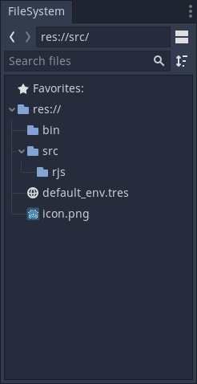

(pic. 11) The *FileSystem* window should seem like this once
the creation is complete *(using the command)*.

### 4.3.2 Executable command parsing
Let's examine its embedded command in order to comprehend
what the executable *(which we used to build the command)* does. 

*The "bin/watch" file contains the following command:*
```bash
rjsv -c -w -s src/rjs -o src/js -ot jsx
```

- **rjsv** *(RubyJS-Vite)*: Launches the setup utility.
- **-c** *(Compile)*: Transforms *RJS* scripts into *JS* form.
- **-w** *(Watch)*: Real-time monitoring of *RJS* file changes. 
- **-s** *(Source)*: Relative path to *RJS* files.
- **-o** *(Output)*: Relative path for transformed *JS* scripts.
- **-ot** *(Output Type)*: The transformed file's prefix type.

## 5 Scripting
To script in Ruby, open a new terminal, specify the location to the
*"rubyjs"* project, and then execute the *"bin/watch"* file.
This turns on the process of converting script files into *JS*, which we'll
leave running in the background so we can minimalized the terminal window.
The text editor, which has a workspace in the root project,
will then be launched. So, we are prepared to script the project's nodes.

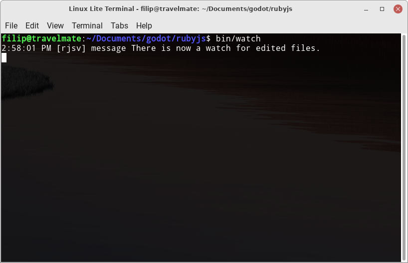

(pic. 12) A terminal running the real-time file change tracking program *RubyJS-Vite*. 

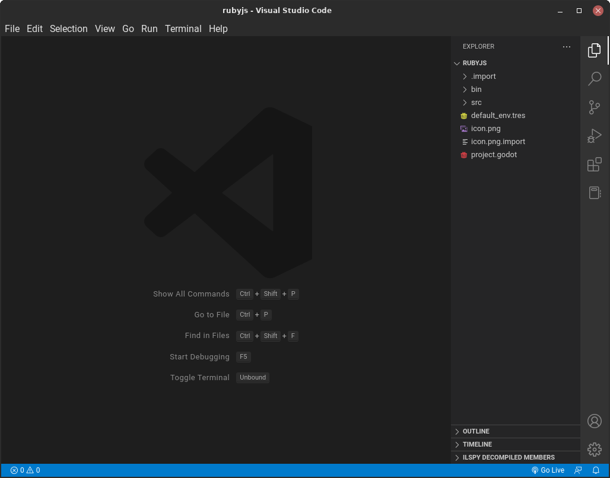

(pic. 13) An open workspace *"rubyjs"* project in the text editor *VSCode*.

### 5.1 Script writing
We'll attempt to draft a script for the test character.
When the game is switched on, the character will be centered
in the centre of the window and will move using the defined Input. 

> ### Warning
> You should place all *RJS* scripts in the *"src/rjs"* directory,
> I should tell you. This is due to the *RubyJS-Vite* tool being active
> and watching this directory. 

*Here is how the character's script will appear after being saved as **character.rjs**:*
```ruby
# src/rjs/character.rjs

export default class Character < godot.KinematicBody2D
  SPEED = 200
  ACCLERATION = 500

  def initialize
    super

    @direction = godot.Vector2::ZERO
    @velocity  = godot.Vector2::ZERO
  end

  def _ready()
    @win_size = godot.OS.get_window_size()
    self.global_position = godot.Vector2.new(
      @win_size.x * 0.5, @win_size.y * 0.5
    )
  end

  def _physics_process delta
    @velocity = @velocity.move_toward(@direction * SPEED,
      ACCLERATION * delta)
    @velocity = self.move_and_slide(@velocity)
  end

  def _input event
    if event.constructor.name == "InputEventKey"
      @direction.x = godot.Input.get_action_strength('move_right') -
        godot.Input.get_action_strength('move_left')
      @direction.y = godot.Input.get_action_strength('move_down') -
        godot.Input.get_action_strength('move_up')
      @direction.normalized()
    end
  end
end
```

This script is automatically converted into a *JSX* file after
being saved *(which Godot can read in the Editor)*.
We can see that the script was altered in the terminal
when *RubyJS-Vite* was executing.
It informs us that *"character.jsx"* has been compiled in *"src/js"*. 

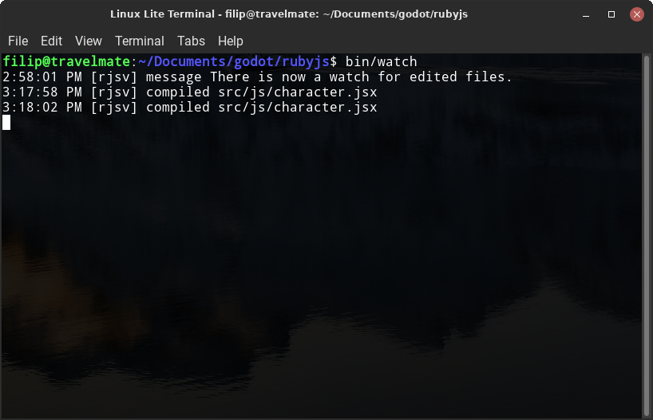

(pic. 14) A terminal running the *RubyJS-Vite* program, which provides information
about the file's compilation.

## 6 Scene
We already have the character's script prepared,
but the game scene still has to be set up.
Prior to creating a scene with the character,
we first set up the character's input.
Next, we add a *JSX* script to the scene. 

### 6.1 Input
We must first enter the project settings window in order to set the Input.
It may be accessed by selecting *"Project -> Project Settings..."* from the menu
in the upper left corner of the screen, which will launch a window in *Godot*.

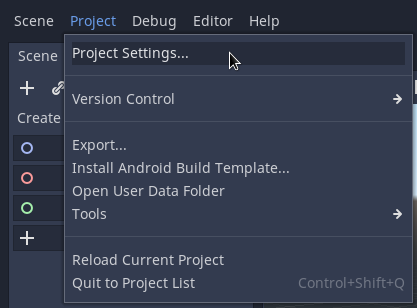

(pic. 15) Rendered menu for project settings.

After launching the window, we will navigate to the *"Input Map"*
area and add the appropriate actions that will be activated by the set key.
We close the *Project Settings* window when our actions have been added,
and everything is then set. 

*We'll include these actions in the list of actions and give them a key:*
- **move_left**: A, Left *(key)*
- **move_right**: D, Right *(key)*
- **move_up**: W, Up *(key)*
- **move_down**: S, Down *(key)*

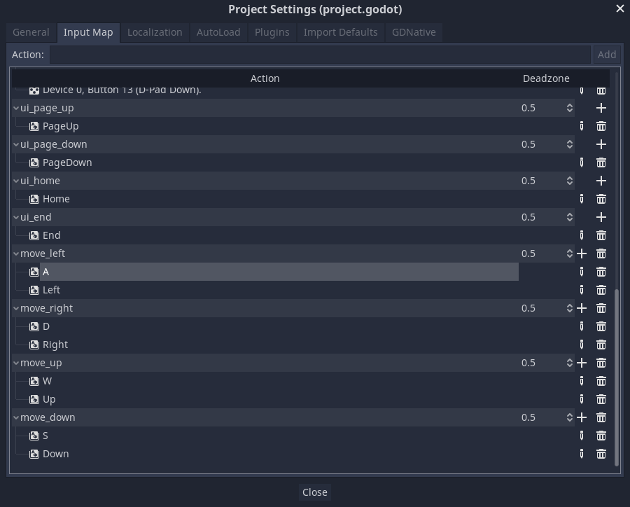

(pic. 16) *Project Settings* window opened with actions added to the *Input Map* area.

### 6.2 Character
It's time to make the character's node.
It will be made using *"KinematicBody2D"* and given the name *"Character"*.
Further nodes will be added later, including *"Sprite"*
and *"CollisionShape2D"*. Put the *Godot* icon to the sprite, and then add
a *"RectangleShape2D"* with a size that touches the edges of the icon.

We will use the *Inspector* to add our previously written script so
that we don't forget about the *Character*. The Script property from the
inherited Node class may be found on the right side of the *Inspector* window.
*"Character.jsx"* is inserted here.

The next scene is ready when we save everything in the *"scenes"*
and *"characters"* folders. 

> ### Info
> Following the order of the creation process, I will list the
> supporting images here.

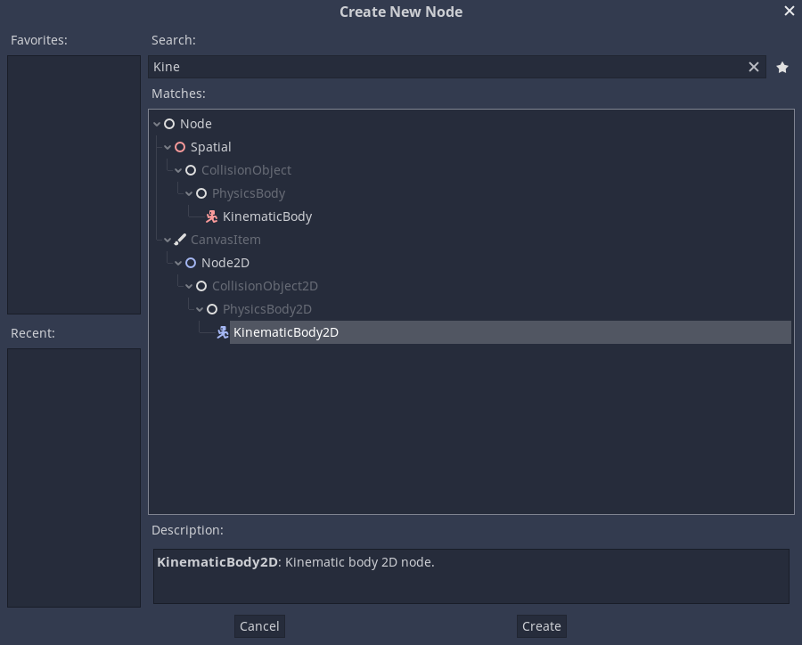

(pic. 17) The KinematicBody2D class is chosen when making a new node. 

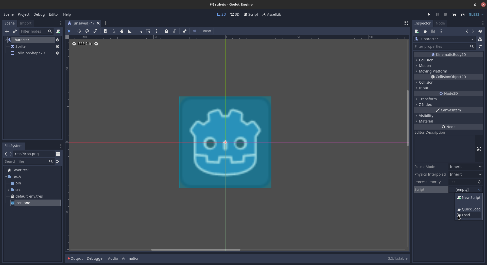

(pic. 18) Prepared *Character* node, into which we attempt to use the
*Inspector* to load the prepared script.

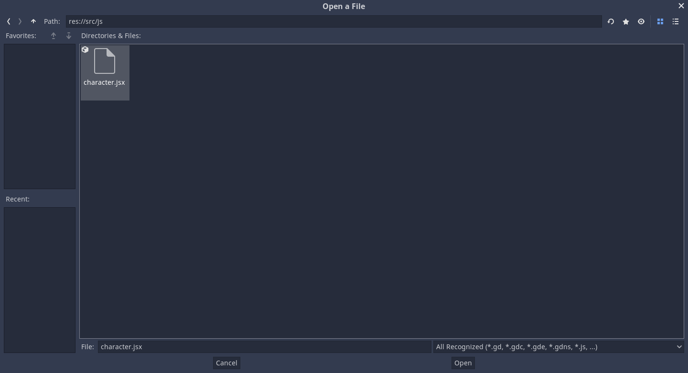

(pic. 19) The *"character.jsx"* file that was chosen for the *Character* node. 

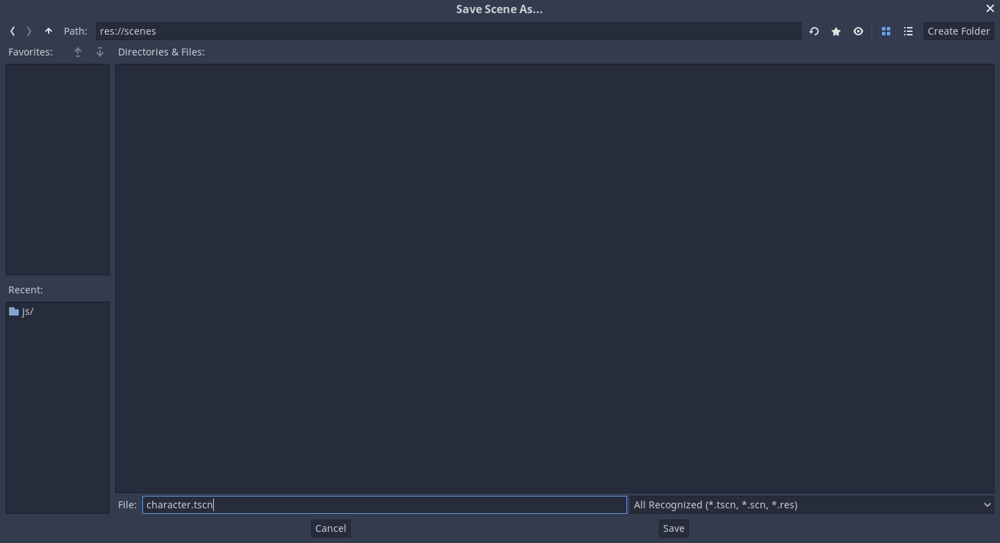

(pic. 20) The *Character* scene is saved as *"character.tscn"* in the necessary
*"scenes"* folder.

### 6.3 Main
Let's set up a new scene once more.
When the game is launched, our main level will be the first to appear.
Hence, when creating it, we choose the *"2D scene"* and give it the
name *"Main"*. We'll use the *"Instance Child Scene"* button next to the
addition icon to add our prepared *"Character"* scene to this scene.
We choose the first scene listed in the menu, *"scenes/character.tscn"*,
from the window that appears.

Also, this *"Main"* level needs to be saved in the selected *"scenes"* folder under the name *"main.tscn"*. 

> ### Info
> Following the order of the creation process, I will list the
> supporting images here.

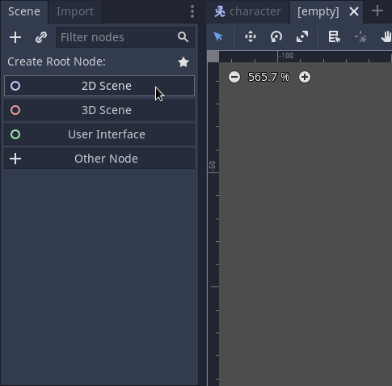

(pic. 21) A new scene is created with a *"2D Scene"* node.

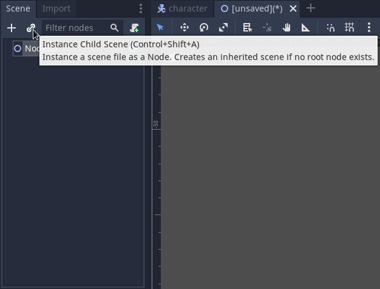

(pic. 22) With the *"Instance Child Scene"*, an additional scene
is added to the *"Main"* scene.

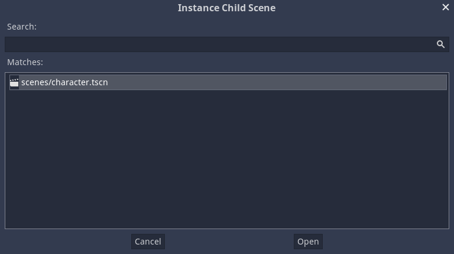

(pic. 23) Open the *"Instance Child Scene"* window and choose the
scene *"scenes/character.tscn"*.

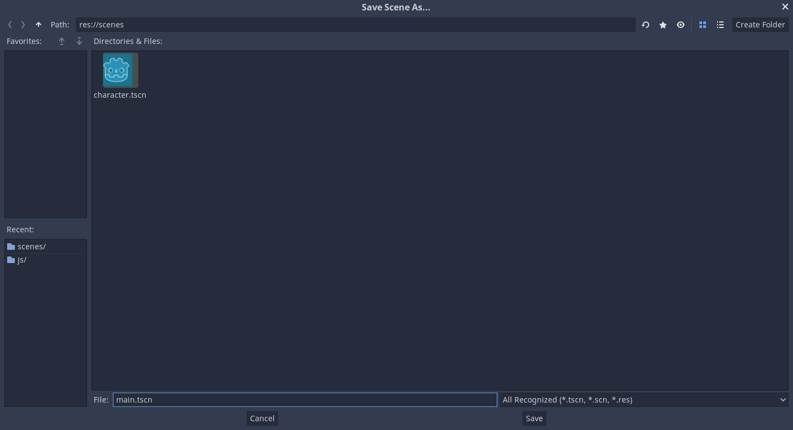

(pic. 24) Saving the *"Main"* scene as *"main.tscn"* in the *"scenes"* folder.

### 6.4 Play the Project
We can test out the entire *RubyJS* project now that it is finished.
When we click the *Play* button in the *Godot Editor*,
the program will initially ask us to begin in which main scene.
When we choose the *Main* scene, a new window containing
the game project opens. 

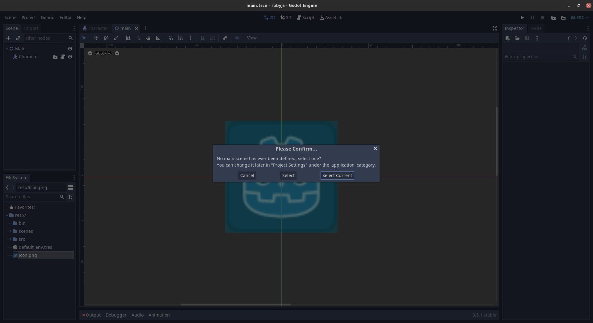

(pic. 25) A dialog appears requesting that you choose the project's main scene before starting the game.

Now, you may use the keyboard to check out how well our character moves
across the screen. This is your first scripting project
using *Ruby* syntax, so congrats. 


(pic. 26) A screen icon that can be moved around using the keyboard. 

## 7 Conclusion
Finally, I'd want to let you know about the benefits and drawbacks of the
*RubyJS-Vite* tool and *ECMAScript* module. I'll then let you know about
further alternatives that will eventually be resolved with *GDNative*.

### 7.1 Advantages & Disadvantages
Here, we'll examine the benefits and drawbacks and determine the overall
assessment.

- #### Advantages
  - You can use any programming language that can convert code into *JS*.
  - Scripting is accessible through *RJS* and consequently also through *JS*.
    You can combine them if you work in a team and prefer your own scripting
    language. 
  - You can incorporate the *JS* ecosystem into a *Godot* project,
    so download and utilize your preferred package. 
  - Scripts written with *Ruby* syntax are easier to read.
  - The *RubyJS-Vite* utility automatically converts every *RJS* script into
    *JS*.

- #### Disadvantages
  - Scripting in *RJS* requires caution. This is because *Ruby2JS* leverages
    the *JS API* and borrows *Ruby* syntax. So, you won't find any *Ruby*
    functions here if you want to use them. 
  - For scripting *RJS* files, an external text editor is required.
  - The command to check for *RJS* files being converted into *JS* must always
    be manually enabled when activating *Godot Editor*.
  - We must not use script creation directly in *Godot* if we want to fast
    create Scenes and insert scripts into them. This is due to *RJS's*
    inability to both recognize and create files. 
  - The biggest drawback is that the *JSX* files that power the node
  functions cannot be read when the project is exported for the real-world
  version. This is due to the fact that the *ECMAScript* module is only
  implemented for the *Godot Editor* and not for constructing the project.

> ### Evaluation
> Following consideration, I must reassure you that this scripting method is
> not appropriate for the production version of the game. Only while the
> project is being built do issues surface.

### 7.2 Other options
When I realized this was not a good choice, I looked up more information in
the *Godot* articles. What I'm discovering is that *GDNative*, which provides
a dynamic library, can be used. This library was created using the *C*
programming language. This is wonderful news in my opinion because *Godot*
can be expanded using a library and does not require the compilation of the
whole *Godot Editor*. There are no issues because the project and library are
exported together when the project is exported to the production version.

The library must be expanded to include the *MRuby* scripting language. That
will be incorporated into the library, and I would also address core
threading using the *V* programming language. The built-in *EditorPlugin*
class would then be used to connect everything to the Editor. I would start
programming in the Editor and get the plugin from *Godot Assets* section.
Hence, no outside text editor would be used.

*This option will be created, but in the interim, I'll provide you with a*
*repository link:*
- [godot-mruby](https://github.com/filipvrba/godot-mruby)

## 8 Comment
- Doc Repository: [Godot Languages Support](https://github.com/Vivraan/godot-lang-support)
- Repository: [ECMAScript](https://github.com/Geequlim/ECMAScript)
- Repository: [RubyJS-Vite](https://github.com/filipvrba/ruby-js)
- Repository: [Godot](https://github.com/godotengine/godot)
- Post: [I succeeded in starting both Godot and my RubyJS-Vite utility. The way it operates is that ECMAScript, which I created in Godot, is further changed by RubyJS. I am able to script using Ruby syntax.](https://www.reddit.com/r/ruby/comments/11736e7/i_succeeded_in_starting_both_godot_and_my/)
- Page: [Godot Features](https://godotengine.org/features/)
- Page: [Introduction to the buildsystem](https://docs.godotengine.org/en/stable/development/compiling/introduction_to_the_buildsystem.html#doc-introduction-to-the-buildsystem)
- Page: [Using an external text editor](https://docs.godotengine.org/en/stable/tutorials/editor/external_editor.html)
- Page: [Ruby2JS](https://www.ruby2js.com/)
