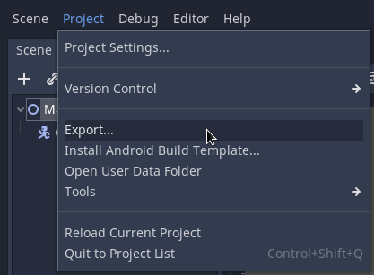
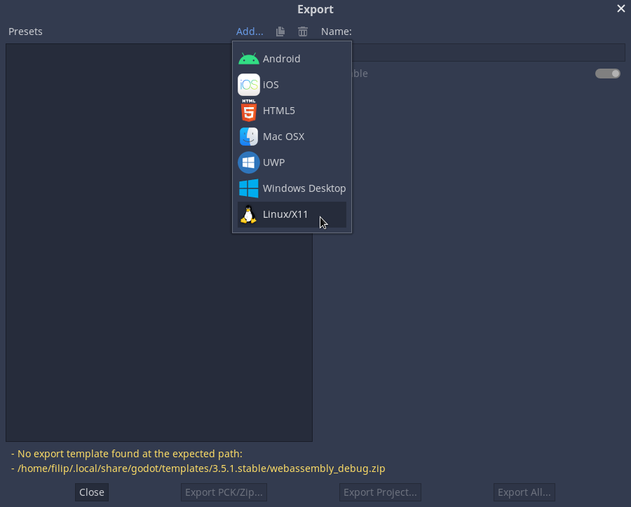
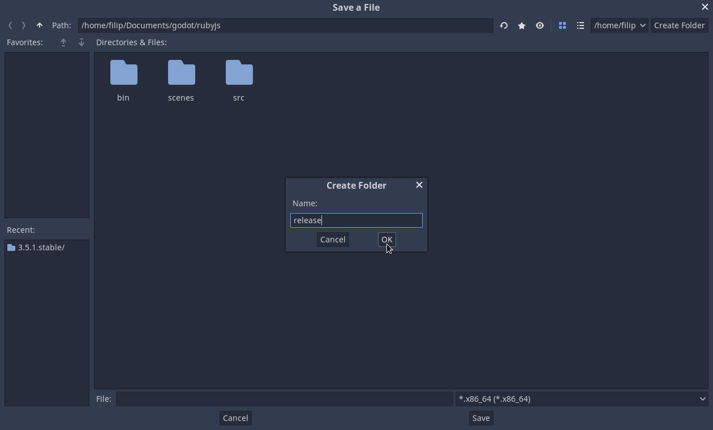
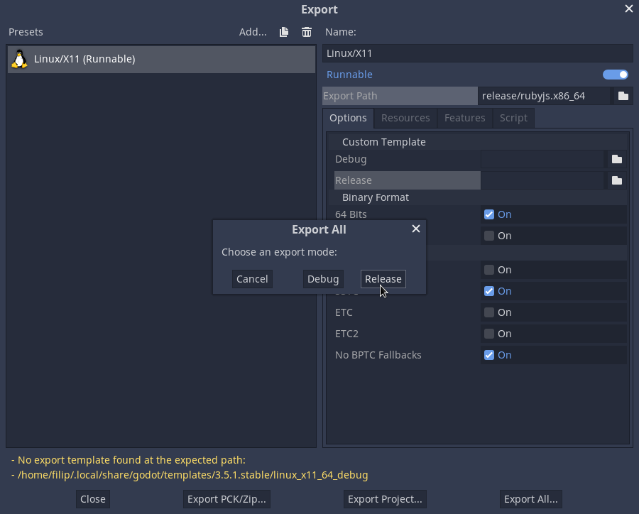

### Content
- [1 Godot with Ruby syntax II](#1-godot-with-ruby-syntax-ii)
- [2 Build](#2-build)
  - [2.1 Renaming](#21-renaming)
- [3 Optimalization](#3-optimalization)
- [4 Moving](#4-moving)
- [5 Project export](#5-project-export)
- [6 Conclusion](#6-conclusion)
- [7 Comment](#7-comment)

## 1 Godot with Ruby syntax II
In the last article we discussed the implementation of RubyJS-Vite with ECMAScript module into Godot Engine. After a successful installation, we were able to create a Demo using RJS script, which has a similar syntax to Ruby but uses the JS API. However, when exporting the game project, we ran into an issue that our RJS files with the ECMAScript module were not supported in the Release template. In this article, we will look at how to fix this bug and create a custom Release template with ECMAScript module support. We will also show how to optimize the template to reduce the size, for example by deleting the debug symbols.

## 2 Build
If you haven't yet added ECMAScript to the modules directory in the Godot Engine source code, you can find the procedure in the previous article called [Godot with Ruby syntax](./gwrs.md). Then, in the main Godot source files folder, open a terminal and run the build release template command:

```bash
scons platform=x11 target=release tools=no
```

> ### Info
> - *platform*: specifies the platform you want to build for. In the example, "x11" is given, which means Linux.
> - *target*: indicates that the build should target a Release version.
> - *tools*: indicates whether you want to build the Editor, which is not necessary in the case of the Release template, since the value is set to "no".

### 2.1 Renaming
After running the build release template command using *SCons* in the terminal and completing it, we find a file named "godot.x11.opt.64" in the "/bin" directory. However, this file is not recognizable to the *Godot Engine*, so we rename it to "linux_x11_64_release".

## 3 Optimalization
We notice that the file "linux_x11_64_release" takes up more disk space due to the presence of debug symbols. For the release version, however, we do not need these symbols and can therefore remove them. This process can reduce the file size up to 10 times.

*To remove the debug symbols from the release template, use the following command:*
```bash
strip ./linux_x11_64_release
```

## 4 Moving
After successfully completing the previous steps, we now have the "linux_x11_64_release" template ready for *Godot Engine*. To place this template in the right place, we need to create the necessary folders and copy the template to the shared template directory.

*We can use the following command for this purpose:*
```bash
mkdir -p ~/.local/share/godot/templates/3.5.1.stable/ && \
cp ./linux_x11_64_release ~/.local/share/godot/templates/3.5.1.stable/linux_x11_64_release
```

> ### Info
> It is important to note that the template is designed for *version 3.5.1 of Godot Engine*, so we will place it in a directory named **3.5.1.stable** in the shared folder for templates.

## 5 Project export
Now we can export the game project. Let's try it on the demo project we created in the previous article. First, let's open the "rubyjs" project in the Godot editor. In the upper left part, click on "Project" and then click on "Export..." in the menu.



(pic. 1) In the editor, the project is expanded with a menu of further options, among which the "Export..." option is selected, which we want to use to export the game project.

After opening the Export window in the Godot editor, we click on the "Add" button next to "Presets" to add a new preset for export. We then select "Linux/X11" from the menu, which is a Linux template.



(pic. 2) In this image we can see the "Export" window open, in which we add the platform for "Linux/X11" in the left list.

After adding the template for **Linux/X11**, we will see this option in the left list in the *Export* window and on the right side we will see other options for exporting. The important thing now is to determine where we want to export our game project and in which folder. We do this by filling in the "Export Path" field. To create a new folder where we will save the output file, click on the folder icon next to this field and another window will open. Here we select or create the folder for the output and name it "release". Now we will create a new file in it called "rubyjs", which is the name of our game project, and click on "Save".



(pic. 3) The "Save a File" window opens in the root folder of the project, where a new folder called "release" is created.

Now we have everything we need set up and can export our project. Just click on the "Export All..." button. and then select the "Release" option to export the project.



(pic. 4) In the "Export" window, the export platform "Linux/X11" is already selected and the "Export Path" entry is set to the "release" folder in the project root. When the "Export All" window opens, the export mode for "Release" can be selected.

After a successful export, you can run the file "release/rubyjs.x86_64", which is located in the root directory of the project. If the file opens without any problems, does not crash and can be navigated using the *Godot Icon*, congratulations! You have a working game project in the Release version that you can safely forward to your friends.

## 6 Conclusion
Finally, I would like to point out that thanks to [RubyJS-Vite](https://github.com/filipvrba/ruby-js) it is possible to script a game project in *Godot Engine* using *Ruby* syntax. This tool makes it easy and fast to write scripts in *Ruby*, which may be more convenient for some developers than traditional *GDScript*. If you are looking for new ways to improve your game project and make development easier, you should definitely try [RubyJS-Vite](https://github.com/filipvrba/ruby-js).

In this guide, we learned how to export a game project for the *Linux/X11* platform and create a *Release* version of the project. If everything went well, you can run the "rubyjs.x86_64" file to verify that your project is working properly. This process can be time consuming, but it is worth it because this way you can share your work with others and get feedback that can help you improve your project. If you have any questions or need help developing your project, don't hesitate to contact the game development community who can provide helpful hints and tips.

## 7 Comment
- Doc Repository: [Godot with Ruby syntax](./gwrs.md)
- Page: [Optimizing a build for size](https://docs.godotengine.org/en/3.5/development/compiling/optimizing_for_size.html)
- Video: [Advanced Godot | Creating Web Export Templates with Emscripten](https://youtu.be/gjiKyKuSr8A)
- Repository: [RubyJS-Vite](https://github.com/filipvrba/ruby-js)
